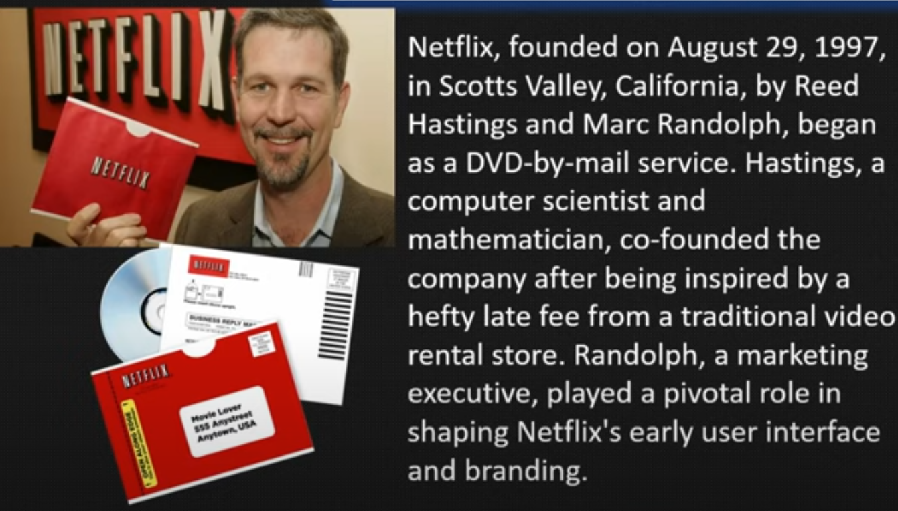
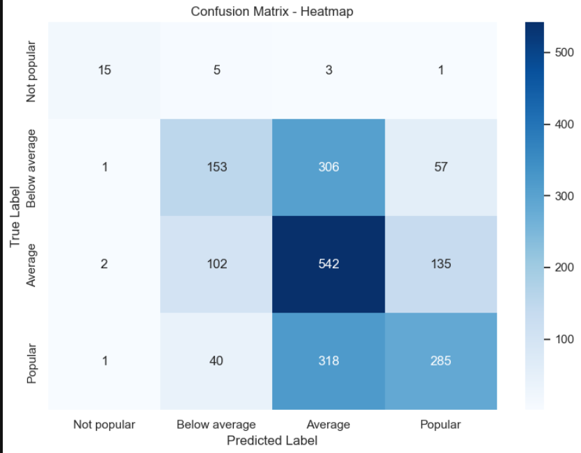
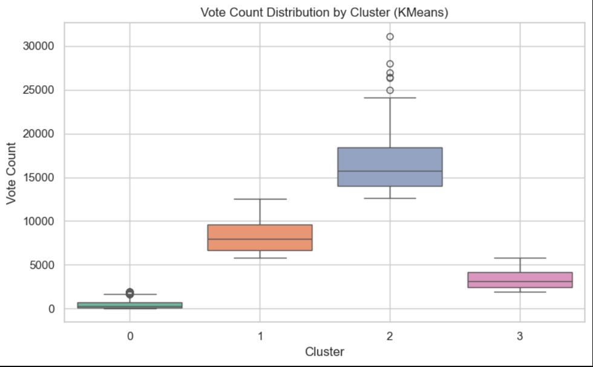
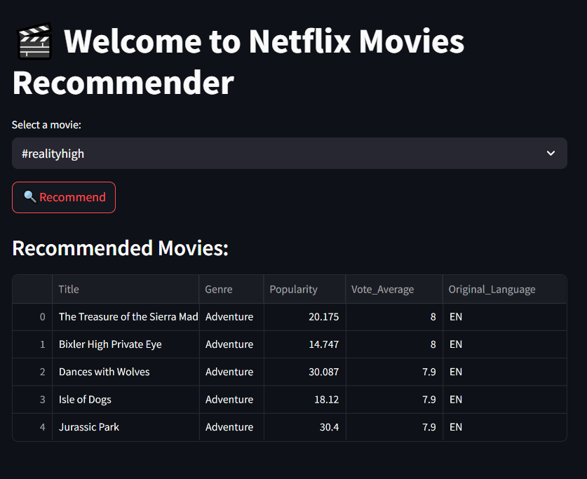

# 🎬 Netflix Movies Data Analysis & Recommender System

This project is an **end-to-end data analysis and machine learning pipeline** built using a Netflix movie dataset. The project explores movie trends, genre-based patterns, and builds machine learning models to predict movie popularity and ratings. It also includes an interactive **Streamlit app** that recommends movies based on selected features.


## 📌 Project Objectives

The project consists of 15 objectives, each solving a specific analytical or machine learning task:

1. **Categorizing the 'Vote_Average' column**  
2. **Splitting the 'Genre' column into main categories**  
3. **Identifying the most frequent genre in the dataset**  
4. **Finding which genre has the highest total votes**  
5. **Finding the movie with the highest popularity and its genre**  
6. **Finding the movie with the lowest popularity and its genre**  
7. **Analyzing which year had the most movies filmed**  
8. **Exploring the relationship between Popularity and Vote Average**  
9. **Drawing a Genre-wise Popularity plot**  
10. **Predicting `Vote_Average_Category` using Random Forest**  
11. **Predicting a movie's Popularity Score using Linear Regression**  
12. **Predicting a movie's Popularity Score using Ridge Regression**  
13. **Clustering movies based on Genre**  
14. **Clustering movies based on Vote Count**  
15. **Building a Streamlit app for recommending movies using Genre, Vote Count, Popularity, and Original Language**


## 📊 Technologies Used

- Python (Pandas, NumPy, Matplotlib, Seaborn)
- Scikit-learn (ML models and preprocessing)
- Streamlit (for building the movie recommender app)
- Jupyter Notebook (for EDA and model development)


## 📊 Key Insights

- We can notice from the above visual that "Drama" genre is the most frequent genre in our dataset and has appeared more than 14% of the times among 19 other genres.
- "Average" Vote category has the highest vote count while the Not_popular voting has the lowest vote count.
- Spider-Man: No Way Home has the popularity and it's genre is Action,Adventure and Science Fiction
- The United States vs. Billie Holiday and Threads are the low popular film and their genre are Music,drama,history and war,drama and science fiction respectively.
- 'Animation' genre has the highest average popularity and history has the lowest average popularity and this analysis is also important and useful for Recommender system.	
- Cluster 3 (Genre: Animation) has the highest Popularity and cluster 2 (Genre: family) has the lowest popularity
- Cluster 0 (Genre: Drama) has the highest vote count and cluster 1 (Genre: horror) and cluster 3 (Genre:Animation) has almost have the same vote_count
-Despite being using(Ridge,Linear Regression and Gradient Boosting)such 
a powerful model they are underperforming.The reason might be that the Predicted Features like Genre, Vote_Count and Vote_Average doesn't have any strong predictive relationship and any correlation with Popularity.
-Popularity might be affected by other factors like casting, external marketing,media buzz etc.


## 📸 Visual Highlights

### History Of Netflix


### Confusion Matrix


### Vote Count Distribution


### App Interface



## 🚀 How to Run

1\. \*\*Clone the repository\*\*:

\```bash
git clone https://github.com/AsharAftab20056/Netflix-Movie-Data-Analysis


2\. \*\*Install dependencies\*\*:

\```bash

pip install -r requirements.txt

\```

3\. \*\*Run the notebook\*\*: Open `Netflix Data Analysis.ipynb in Jupyter Notebook or JupyterLab and run all cells.


## 🚀 How to Run App

- Run cell no.34 code in the jupyter notebook
- After running the code write the following command in command prompt or in Anaconda Prompt:

1. cd [file path]
2. streamlit run Netflix_App.py
   
Local URL: http://localhost:8501
Network URL: http://192.168.0.107:8501


Download the dataset: 
https://drive.google.com/file/d/17hlvqfWwgOpmgv579kB5rXCuxbkG-kTi/view?usp=drivesdk

\```

\---

## 👤 Author

### Ashar Aftab 

GitHub: https://github.com/AsharAftab20056


LinkedIn: www.linkedin.com/in/ashar-aftab-b09924295


\---

\> If you found this project useful or insightful, consider giving it a ⭐ on GitHub!
